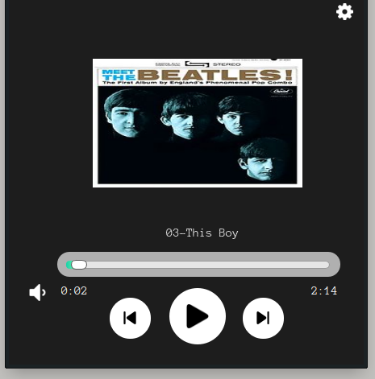

# /Music Player
## Aplicación creada usando Python 3.9.2
___
## Módulos requeridos para el funcionamiento:
- ## pyside2 =  un binding de la biblioteca gráfica Qt para el lenguaje de programación Python

### vista reproductor

***
# /scripts
## pyui5
    transforma los archivos .ui en archivos .py 
    ejemplo:
    pyuic5 -o ejemplo.py ejemplo.ui
## pyrcc5 
    transforma los archivos .qrc 'Qt's resource compiler' en archivos .py ejecutables
    ejemplo:
    pyrcc5 -o resources.py resources.qrc